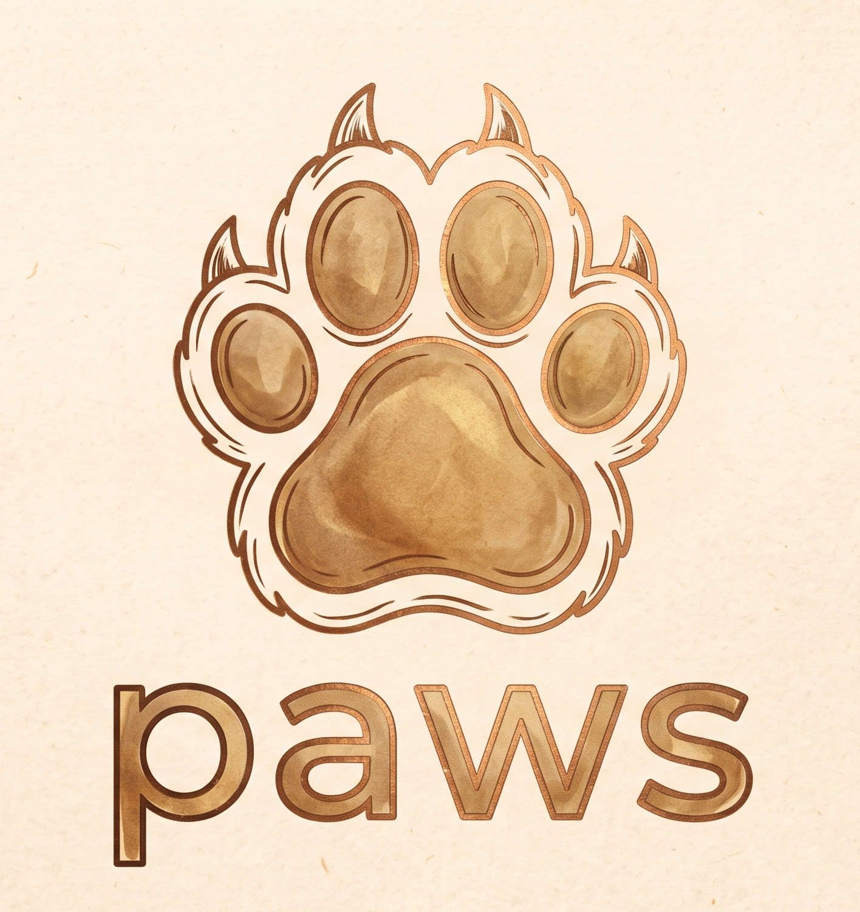

<p align="center">
  
</p>

# paws

**Run-anywhere CI/CD pipelines, backed by [Dagger](https://dagger.io), shipped as a single Rust
binary.**

`paws` runs the same build/test/audit/release pipeline whether it's executing inside GitHub
Actions or on your laptop. No YAML lock-in, no "works in CI but not locally" — one binary, one
set of commands, everywhere.

[](https://github.com/mbround18/paws/actions/workflows/ci.yaml)
[](LICENSE)

## Why

Most CI setups tie your build logic to your CI provider's YAML dialect. Debugging a failing
check usually means pushing a commit and waiting, because there's no easy way to reproduce the
exact pipeline locally. `paws` exists to remove that dependency: every subcommand is a normal CLI
program that runs the same way on your machine as it does in CI, backed by
[Dagger](https://dagger.io) for portable, cacheable container execution rather than
provider-specific scripting.

## What it does

| Command | What it does |
| --- | --- |
| `paws init` | Install the `dagger` CLI, which most other subcommands need on `PATH` |
| `paws ci` | Build, lint, and test a Node or Rust project |
| `paws semver` | Compute the next version from PR labels, branch name, or an explicit bump |
| `paws docker` | Resolve and build a container image the way `docker-compose`-aware pipelines do |
| `paws audit` | Run a security/compliance scanner suite and summarize the findings |
| `paws provision` | Install multiple toolchains (Rust, Node, Python, ...) concurrently, not one at a time |
| `paws docs` | Build workspace documentation |
| `paws release` | Cross-compile, smoke-test, package, and publish a release binary for Linux, Windows, and macOS |
| `paws helm` | Lint (and optionally package) Helm chart(s) |

Run `paws --help` or `paws <command> --help` for the full flag reference.

## Status

Early and actively developed — pre-1.0, versions like `0.0.1-prerelease.N`. The core subcommands
work and are tested against real fixtures and a real Dagger engine, not just unit tests, but the
surface is still growing. See [`docs/DEVELOPMENT.md`](docs/DEVELOPMENT.md) for exactly what's
verified where.

## Installation

Prebuilt binaries are published as prereleases on the
[Releases page](https://github.com/mbround18/paws/releases) for Linux (x86_64/aarch64, glibc and
musl), Windows (x86_64), and macOS (x86_64/aarch64) — still pre-1.0, so expect breaking changes
between prereleases. Pick whichever of these fits how you're using `paws`:

### Local install script (recommended for local dev)

Detects your OS/arch, downloads the matching binary, and puts it on `PATH` (`~/.local/bin` by
default) — the same logic `actions/paws-up` uses in CI, as a standalone script:

```sh
curl -fsSL https://raw.githubusercontent.com/mbround18/paws/main/scripts/install.sh | sh
```

Pin a version, or change the install directory, via env vars:

```sh
PAWS_VERSION=v0.0.1-prerelease.18 PAWS_INSTALL_DIR=/usr/local/bin \
  curl -fsSL https://raw.githubusercontent.com/mbround18/paws/main/scripts/install.sh | sh
```

This is also the pattern to wire into a downstream repo's own `Makefile`/setup docs — see
[`mbround18/helm-charts`'s `make install-paws`](https://github.com/mbround18/helm-charts/blob/main/Makefile)
for a real example.

### GitHub Actions

`actions/paws-up` installs `paws` and (by default) runs `paws init` to install `dagger` too —
most subcommands need both:

```yaml
- uses: mbround18/paws/actions/paws-up@main
- run: paws ci --toolchain rust
```

| Input | Default | Description |
| --- | --- | --- |
| `version` | `latest` | Pin a specific release, e.g. `v0.0.1-prerelease.18`, instead of tracking the newest one. |
| `github-token` | `${{ github.token }}` | Token used to query/download the release — override if the default token's rate limit is a problem. |
| `install-dagger` | `true` | Set to `false` to skip `paws init` (e.g. a self-hosted runner that already has `dagger` on `PATH`). |

### From source

Needs a [Rust toolchain](https://rustup.rs):

```sh
git clone https://github.com/mbround18/paws.git
cd paws
cargo install --path crates/paws-cli
```

### After installing

Most subcommands also need the `dagger` CLI on your `PATH` — run `paws init` to install it
(or see https://docs.dagger.io/install for other options). `actions/paws-up` already does this
for you unless `install-dagger: false` is set.

## Quickstart

```sh
# Compute the next version — works fully offline, no dagger needed
paws semver --base v1.0.0 --prefix v --branch main
# -> v1.0.1

# Build and test a project
paws ci --toolchain rust

# Resolve how a container image would be built/tagged/pushed
paws docker --image ghcr.io/you/app --version 1.0.0

# Actually publish (needs $DOCKER_TOKEN/$GHCR_TOKEN and the matching
# --dockerhub-username/--ghcr-username, or their $DOCKERHUB_USERNAME/
# $GHCR_USERNAME env fallbacks)
DOCKER_TOKEN=*** paws docker --image you/app --with-latest --dockerhub-username you
```

See [`specs/001-paws-core-cli/quickstart.md`](specs/001-paws-core-cli/quickstart.md) for a full,
subcommand-by-subcommand walkthrough with real example output.

## Language / stack support

`paws ci` fully supports Rust, Node across all four major package managers (npm, yarn, pnpm, bun)
with Vite/Next.js framework detection, `uv`-based Python, and Tauri desktop/Android builds — plain
JS/TS, React, and SSR frameworks all covered. See [`docs/ROADMAP.md`](docs/ROADMAP.md) for the
full target stack list (JVM, Go, .NET, mobile, and more) and an honest read of
what's actually built versus planned.

## Contributing / development

Architecture, crate layout, CI internals, and the reasoning behind non-obvious decisions live in
[`docs/DEVELOPMENT.md`](docs/DEVELOPMENT.md) and [`docs/adr/`](docs/adr/README.md). Start there
if you're looking to build or modify `paws` itself rather than just use it.

## License

[MIT](LICENSE) © MBRound18
